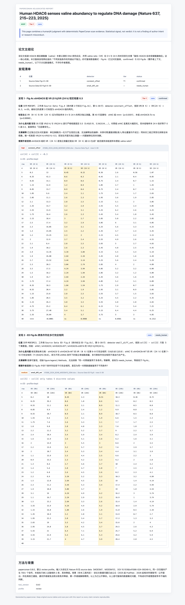

**English** | [简体中文](README.zh-CN.md)

# PaperConan / 论文柯南

> **No statistical signal left unexplained!**
>
> Source data can contain inconsistencies that are easy to miss.
> PaperConan helps surface the clues worth a closer look.
> Pinpointing the data patterns that warrant human review
> is a little Python utility with an unusually rigorous rulebook—
>
> the numerical detective, **PaperConan**!

---

## What It Is

`paperconan` is a **sanity checker for a paper's source data**. Point it at a directory containing `.xlsx`, legacy `.xls`, `.xlsm`, `.csv`, or `.tsv` files; structured tables from supplementary `.pdf` and `.docx` files can live alongside them, as can local images explicitly enabled with `--images`. It runs numerical detectors, catalogs image assets, and hands the locations worth human review—down to the file, sheet, columns, rows, and rule—to an external Agent for assessment.

**It reports statistical signals, not conclusions about author intent.** Any final interpretation still requires the original tables, figure legends, Methods, the authors' response, and verification by the journal or institution.

The most common—and recommended—way to use PaperConan is to **pair it with an AI agent such as Claude Code or Codex and the skill bundled in this repository**. You describe the task in plain language; the agent invokes the actual Python detectors, parses their output, and interprets it under explicit rules instead of eyeballing the numbers. That workflow is the focus of this page. For direct CLI and Python library usage, see the [CLI and library reference](docs/cli.md).

**Who it is for:**

- Graduate students and early-career researchers who want a sanity check before citing a paper
- Labs, research groups, and departments triaging publicly available source data
- People preparing a PubPeer post who want to identify the exact table, rows, columns, and rule before deciding what to ask
- Batch reviewers scanning a journal, an author group, or a set of DOIs before using an agent to prioritize the results

**What it does not do:**

- Determine author intent or responsibility, or replace statistical peer review
- Independently interpret Western blots, microscopy images, gels, or image splicing; semantic image review is handled by an external multimodal Agent that can open local images
- Digitize data points from bar-chart or line-chart pixels
- Configure model APIs, credentials, or provider SDKs; deterministic `image_findings` are optional hints, not a complete review checklist
- Circumvent paywalls or treat the absence of publicly available data as evidence that a paper's data have no issues

---

## See It in Action: A Real Adjudicated Report

The report below comes from a case that is already public and has been addressed by the relevant institution: the Nature paper *Human HDAC6 senses valine abundancy to regulate DNA damage* (Nature 637, 215–223, 2025; DOI [10.1038/s41586-024-08248-5](https://doi.org/10.1038/s41586-024-08248-5)). Source-data inconsistencies associated with the paper were raised publicly on [PubPeer](https://pubpeer.com/search?q=10.1038%2Fs41586-024-08248-5) beginning in 2025 and received wider coverage in 2026. The authors' university later announced personnel actions: the corresponding author was removed as dean and demoted, and the first author's employment was terminated.

Our contribution is deliberately narrow and reproducible: run the paper's public Nature source data through `paperconan`, have an AI agent write `verdict.json` under the skill's [adjudication protocol](#2-connect-the-skill-to-your-agent), and render the result with `paperconan report`.



PaperConan's `constant_offset` detector independently identified the following pattern: in `Source Data Fig.4` (labeled `Fig.4c` inside the sheet), the two **shHDAC6** columns labeled **VR (0 h)** and **VR (24 h)**—which should represent independent measurements of the same sample batch at 0 and 24 hours—differ by **exactly 0.3 in every one of 35 rows** (0.45/0.15, 0.60/0.30, 3.34/3.04, and so on). This is the same Figure 4c data inconsistency previously raised in public. The tool did not infer it from the plotted figure; it located the numerical pattern in the original source data and reported the exact file, sheet, rows, columns, and rule.

The finding was assigned the schema status `confirmed` only after an **adversarial red-team review** that began by assuming it was a false positive and tested ten benign mechanisms one by one. The same scan produced more than 700 signals. The report retained only the one that withstood that challenge and downgraded the rest. That restraint is what signal-not-verdict looks like in practice.

> **Keep the boundary clear:** PaperConan reports **reproducible numerical patterns**, not conclusions about author intent. The institutional actions above are **publicly documented facts**, not a PaperConan judgment. The tool's role is limited to locating signals that anyone can reproduce; subsequent interpretation still requires the original data, the authors' response, and journal or institutional review.
>
> For the complete commands used to reproduce this report, see [Reports and tuning › Adjudicated HTML reports](docs/reports.md#判定后-html-报告).

---

## Quick Start (Recommended: Agent + Skill)

### 1. Install the CLI (the Skill Uses It Behind the Scenes)

Python >= 3.10 is required.

```bash
pip install "paperconan[all]"   # [all] includes PDF / Word table extraction; recommended
pip install "paperconan[image]" # adds only image assets, PDF pages, and optional image hints
paperconan --version            # verify the installation
```

> The base package includes the Rust-powered `python-calamine` reader. It handles legacy `.xls`, `.xlsm`, and `.xlsb` files out of the box and provides a faster path for `.xlsx`. See [CLI and library reference › Installation](docs/cli.md#安装) for other installation variants.
>
> An agent with shell access and a Python environment, such as a local Claude Code or Codex session, will check for the CLI before its first scan and run `pip install` after the skill is installed. You can therefore skip this step and go directly to Step 2 if you prefer.

### 2. Connect the Skill to Your Agent

The simplest option is the cross-agent [`npx skills`](https://github.com/vercel-labs/skills) installer. One command supports Claude Code, Codex, Cursor, and other compatible agents:

```bash
npx skills add zixixr/paperconan                          # install for detected agents

# You can also select agents or installation scope:
npx skills add zixixr/paperconan -a claude-code -a codex  # install only for these two
npx skills add zixixr/paperconan -g                       # install globally for the user
```

The installer clones the repository, discovers the `paperconan` skill, and connects it using each agent's own directory conventions. You do not need to manage the differences between `~/.claude/skills`, Codex, and other agent-specific paths.

**Manual fallback:** If you would rather not use npx, or want the skill to update whenever you run `git pull`, symlink it into Claude Code's personal skill directory:

```bash
git clone https://github.com/zixixr/paperconan.git
mkdir -p ~/.claude/skills
ln -s "$(pwd)/paperconan/skills/paperconan" ~/.claude/skills/paperconan
```

If your agent does not yet discover skill directories, reference `SKILL.md` from the project's agent instructions instead:

```bash
echo '@'"$(pwd)"'/paperconan/skills/paperconan/SKILL.md' >> AGENTS.md
```

Restart the agent session after installing or updating the skill so it can discover the new version.

[`skills/paperconan/SKILL.md`](skills/paperconan/SKILL.md) is the agent entry point. It requires the agent to run the real detectors, interpret their output under the rules in `references/`, and preserve the **signal-not-verdict** boundary.

The skill also includes a reusable public adjudication protocol: [`adjudication-tiers.md`](skills/paperconan/references/adjudication-tiers.md) defines Tier 1/2/3 and `KEEP` / `DROP` / `NEEDS_HUMAN`; [`report-templates.md`](skills/paperconan/references/report-templates.md) defines the short report and the formal eight-section report; and [`adversarial-review.md`](skills/paperconan/references/adversarial-review.md) defines the red-team review process. These tiers indicate review priority and how difficult a signal is to explain through benign mechanisms. **They do not express a conclusion about author intent.**

### 3. Ask in Plain Language

Once the skill is connected, you do not need to remember any commands. Just ask, for example:

- "Check this paper's source data for statistical signals worth reviewing: `10.1038/sxxxxx`"
- "Scan `~/Downloads/source_data/` and show me the few signals that most need human review"
- "Could this cross-sheet match be a false positive? Compare it with the original table"

The agent decides whether to `fetch` or `scan` directly, parses `scan.json`, loads the relevant reference material, and opens the original table when necessary. Its response includes the evidence, plausible benign explanations, and the scientific context that a human still needs to supply.

Image review follows the same workflow. The Agent first confirms that it can open local images, then reads every item in `image_assets`: it inspects the complete image first and uses original-pixel crops for small panels or unresolved details.
`image_findings` provide hints only and cannot replace complete asset coverage. Every asset must be recorded as
reviewed, unresolved, unreadable, or deferred. Numerical and image assessments go into the same
`verdict.json findings[]` array, producing one adjudicated report.

The complete command sequence is:

```bash
paperconan fetch "<DOI or title>" --auto --images --out data/
paperconan data/ --images
paperconan data/ --images --image-diagnostics
paperconan report data/audit/scan.json --verdict verdict.json --out adjudication.html
```

If the Agent cannot open local images, it should set `image_review.status` to
`unavailable_no_multimodal`, state explicitly that semantic image review is incomplete, and continue with numerical review.
PaperConan itself does not call or configure model services.

> An agent without a usable Python environment should ask you to run the command locally. It must **never present an eyeballed guess as PaperConan output**.

---

## Reading the Reports: The Essentials

The `audit/report.html` generated directly by `paperconan <dir>` is a **human-review workbench containing raw signals from deterministic detectors**. By design, it contains **many false positives**: shared controls, redrawn axes, unit conversions, derived columns, and many other hits have benign explanations. It **does not represent a conclusion** and should not be published as a finished report.

**For a formal, interpreted report, use an Agent together with the skill.** The detectors produce reproducible raw signals and optional image hints. The Agent then checks each item against the original table, full image, original-pixel crops, figure legend, and Methods before combining the numerical and image findings into an [adjudicated report](docs/reports.md#判定后-html-报告). The CLI alone does not perform this semantic assessment.

For guidance on reading the raw signals, controlling false positives with `--profile`, and generating an adjudicated report, see **[Reports and tuning](docs/reports.md)**.

---

## ⚠️ Important Notice

`paperconan` reports **algorithmically identified statistical signals**, not conclusions about author intent or responsibility. Final interpretation requires clarification from the original authors, verification by journal editors, or independent peer review.

**Use established channels:** post a specific, reproducible data inconsistency on PubPeer; contact the journal's ethics team; or, where appropriate, contact your institution's research integrity office.

**Do not:** publicly accuse individual authors on social media, present a PaperConan screenshot as a final conclusion, or skip author clarification and jump directly to a judgment.

The tool is neutral. Its use must be, too.

---

## Documentation

This page covers the main workflow. Detailed documentation lives under [`docs/`](docs/):

- [What it detects](docs/detectors.md)—an overview of every detector
- [Reports and tuning](docs/reports.md)—reading reports, controlling false positives with `--profile`, and generating adjudicated HTML reports
- [Recommended batch-scanning workflow](docs/batch-workflow.md)—fetch → scan → filter → build dossiers → agent adjudication → tiering → adversarial review
- [CLI and library reference](docs/cli.md)—installation, scanning, fetch, PDF/Word support, the Python library, and memory/output safeguards
- [FAQ](docs/faq.md)

For the deeper rules used by **AI agents and the skill**, see [`skills/paperconan/references/`](skills/paperconan/references/):
[detectors](skills/paperconan/references/detectors.md) ·
[output-schema](skills/paperconan/references/output-schema.md) ·
[judgment-rubric](skills/paperconan/references/judgment-rubric.md) ·
[interpretation](skills/paperconan/references/interpretation.md) ·
[adjudication-tiers](skills/paperconan/references/adjudication-tiers.md) ·
[report-templates](skills/paperconan/references/report-templates.md) ·
[adversarial-review](skills/paperconan/references/adversarial-review.md) ·
[batch-workflow](skills/paperconan/references/batch-workflow.md) ·
[case-patterns](skills/paperconan/references/case-patterns.md)

---

## Example

[`examples/`](examples/) contains a complete synthetic demo: two synthetic source-data files, a generated `audit/scan.json` and `report.html`, screenshots, and a finding-by-finding walkthrough. Start with [examples/README.md](examples/README.md) and [examples/report-preview.png](examples/report-preview.png), or run it yourself:

```bash
cd examples
paperconan demo_paper
open demo_paper/audit/report.html
```

---

## Roadmap

Completed: `.xlsx` / legacy `.xls` / `.xlsm` / `.csv` / `.tsv` input · HTML reports with evidence highlighting · PDF / Word table input · open-source discovery and download through `paperconan fetch` · Agent skill bundle · columnar engine (fast calamine reads, including legacy Excel) with memory/output safeguards · `review` / `forensic` / `triage` profiles and deterministic prefilter · reuse/transformation detectors for whole-column reuse across sheets and files + matrix decimal-place reuse + contiguous-segment offsets + shared decimals across integer-separated values + fixed row-vector recurrence across figures + **row-wise ratios/equality (including scaled reuse across blocks) + round-number gaps with preserved tails + high-precision tail clustering** · registration of local image assets from permitted sources, optional non-gating image hints, coverage accounting by an external multimodal Agent, and a unified adjudicated report for numerical and image findings.

Not yet completed: cross-paper scanning for reuse across multiple papers from a lab or author group · chart-pixel digitization · more comprehensive deterministic image-pattern hints · PubPeer Public API integration.

Pull requests are welcome—whether you add a detector pattern, improve the documentation, or build a demo.

---

## Why It Exists

PaperConan began as a tool for a YouTube / Douyin / Bilibili video: scan publicly available source data from Nature and other Nature Portfolio journals, then locate numerical patterns that warrant explanation. It is open source so that people doing careful research can spend less time and attention on unreliable data.

## License

MIT.

## Acknowledgments

- *Detective Conan* © Gosho Aoyama / TMS Entertainment. The opening borrows the narrative rhythm of the series' title sequence.
- PubPeer. PaperConan's output should ultimately support public questions that are specific, measured, and reproducible.
